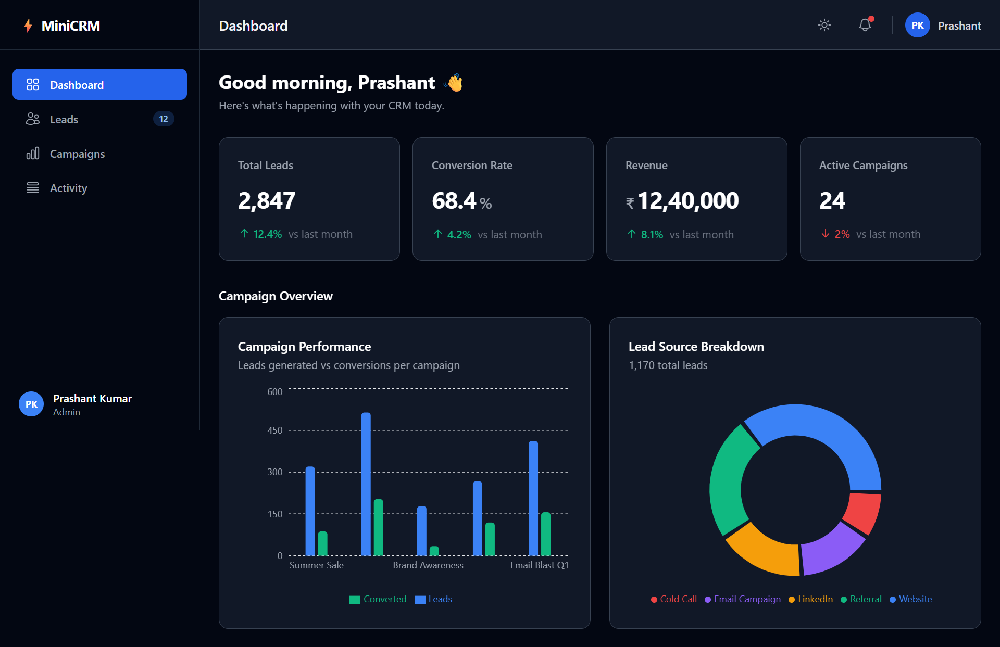

# ⚡ Mini CRM Analytics Dashboard

A production-grade CRM Analytics Dashboard built to demonstrate
senior-level React + TypeScript frontend architecture.



## 🔗 Links

- **Live Demo:** [mini-crm-dashboard-one.vercel.app](https://mini-crm-dashboard-one.vercel.app/)
- **GitHub:** [github.com/prashant-1012/mini-crm-dashboard](https://github.com/prashant-1012/mini-crm-dashboard)

---

## 🛠 Tech Stack


---

## ✨ Features

- **Overview Dashboard** — KPI cards with trend indicators and
  campaign charts preview
- **Leads Management** — Sortable, filterable, paginated data table
  with status badges using TanStack Table v8
- **Campaign Analytics** — Bar chart, donut chart, and line chart
  built with Recharts
- **Real-time Activity Feed** — Simulated live CRM events using
  `setInterval` with pause/resume control
- **Dark Mode** — Full dark theme with toggle, persisted to
  `localStorage`
- **Skeleton Loaders** — Every data section has a loading skeleton
- **Typed throughout** — Strict TypeScript with generics,
  union types, and typed Redux state

---

## 🏗 Architecture Highlights

### Feature-Sliced Structure
```
src/
├── api/              # Axios instance + typed API functions
├── app/              # Redux store with RootState and AppDispatch
├── components/       # Shared UI (ChartCard, Skeleton, Pagination)
│   ├── layout/       # AppShell, Sidebar, Topbar
│   └── ui/           # Atomic components
├── features/         # Feature modules (self-contained)
│   ├── overview/     # KPI slice, hook, components
│   ├── leads/        # Leads slice, hook, table, filters
│   ├── campaigns/    # Campaign slice, hook, charts
│   └── activityFeed/ # Activity slice, hook, live feed
├── hooks/            # Global typed Redux hooks
├── pages/            # Thin route-level page components
├── routes/           # React Router v6 config
├── types/            # Shared TypeScript interfaces
└── utils/            # Pure utility functions
```

### Key Patterns Used
- **Custom hooks** — each feature exports a `useFeatureName` hook
  that encapsulates all Redux logic, keeping pages clean
- **Typed async thunks** — `createAsyncThunk<ReturnType, ArgType>`
  with fully typed `action.payload`
- **useMemo for derived data** — filtering and pagination computed
  values are memoized to prevent unnecessary recalculation
- **Smart/dumb component split** — container components handle data,
  presentational components handle UI only
- **Generic API types** — `ApiResponse<T>` and
  `PaginatedResponse<T>` work across all endpoints

---

## 🚀 Running Locally

```bash
# Clone the repository
git clone https://github.com/prashant-1012/mini-crm-dashboard.git
cd mini-crm-dashboard

# Install dependencies
npm install

# Start both dev server and mock API together
npm run dev:all
```

App runs at `http://localhost:5173`
Mock API runs at `http://localhost:4000`

---

## 📁 Mock API Endpoints

| Endpoint         | Description                    |
|-----------------|--------------------------------|
| `GET /kpis`      | KPI card data                  |
| `GET /leads`     | Full leads list                |
| `GET /campaigns` | Campaign performance data      |
| `GET /leadSources` | Lead source breakdown        |
| `GET /leadTrend` | Monthly lead trend data        |

---

## 👨‍💻 Author

**Prashant Kumar**
Frontend Developer · 4+ years experience
[LinkedIn](#) · [GitHub](#) · [Portfolio](#)